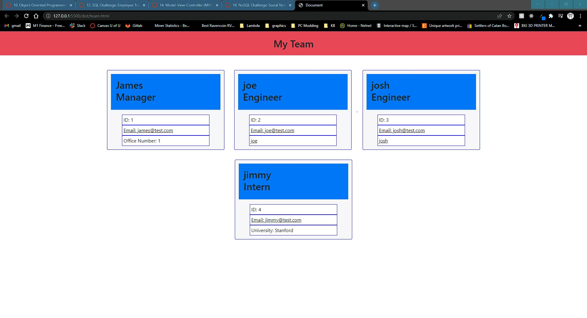

# team-profile-generator

## Description

Generates a team profile based on the data provided in command line

## Installation

npm i then node index.js

## Screenshot of Generated Document

## Link to Video Walk Through

https://user-images.githubusercontent.com/34934109/155898751-22ea9968-bd50-4d14-86a5-ba3973f9eeea.mp4

## License

